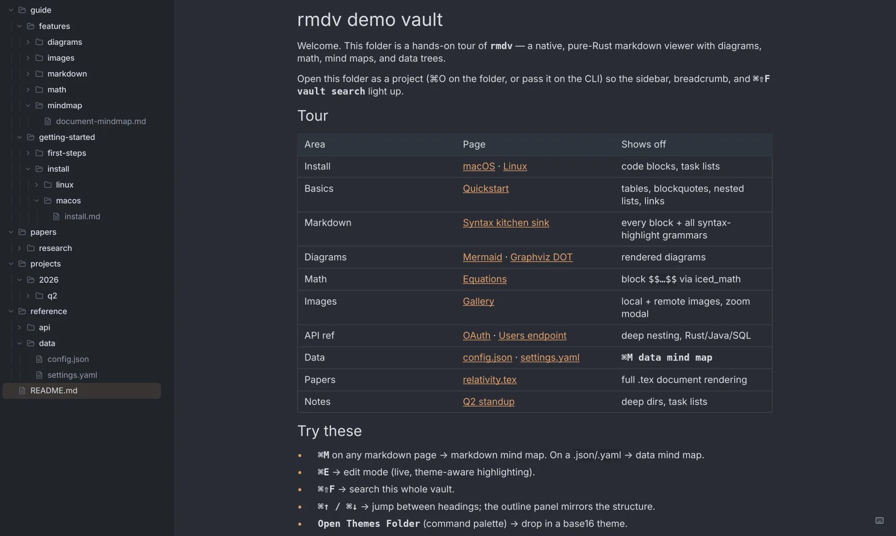
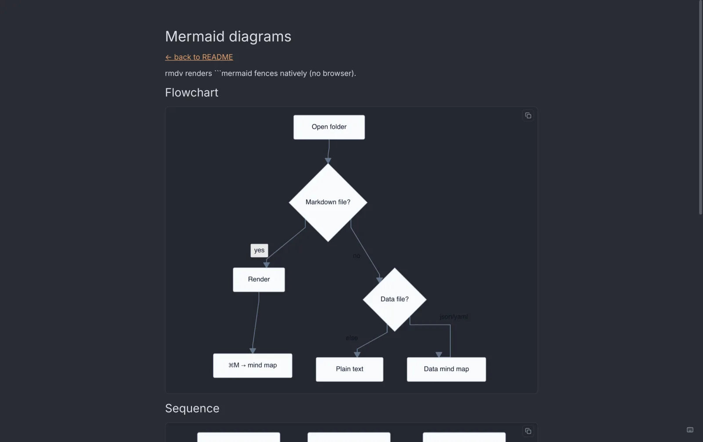
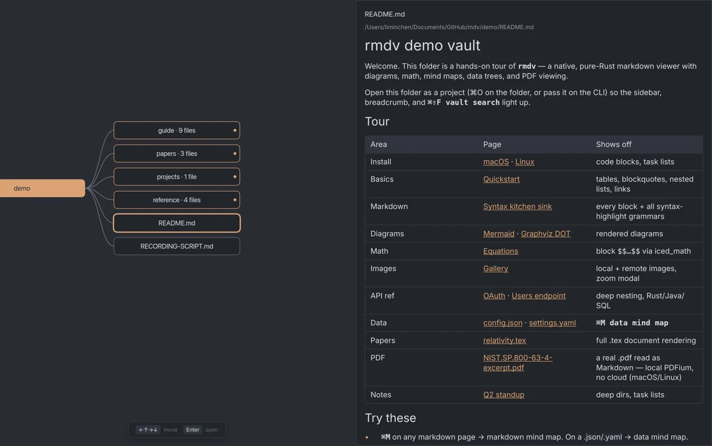
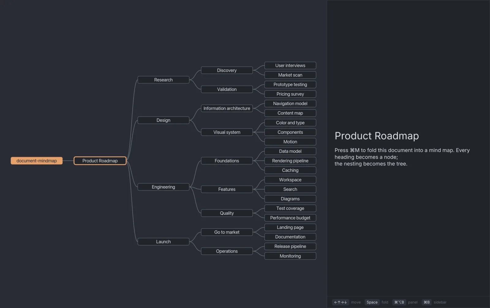
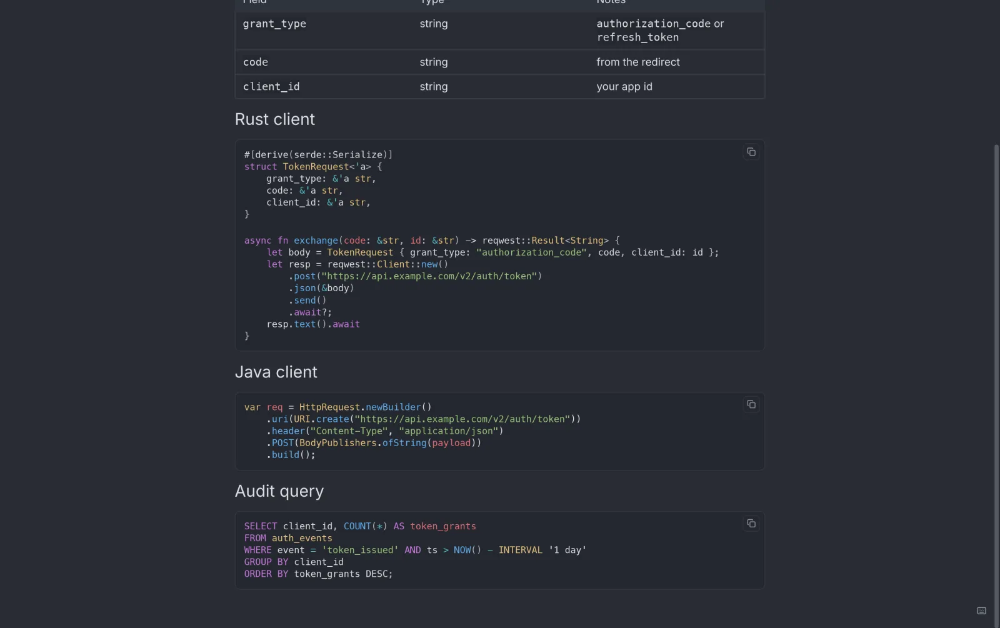
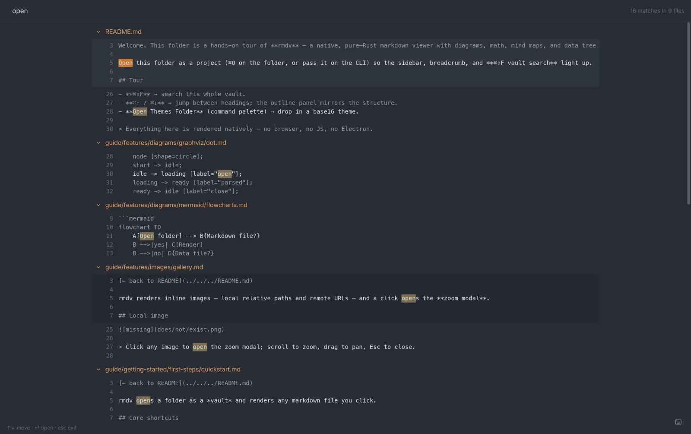
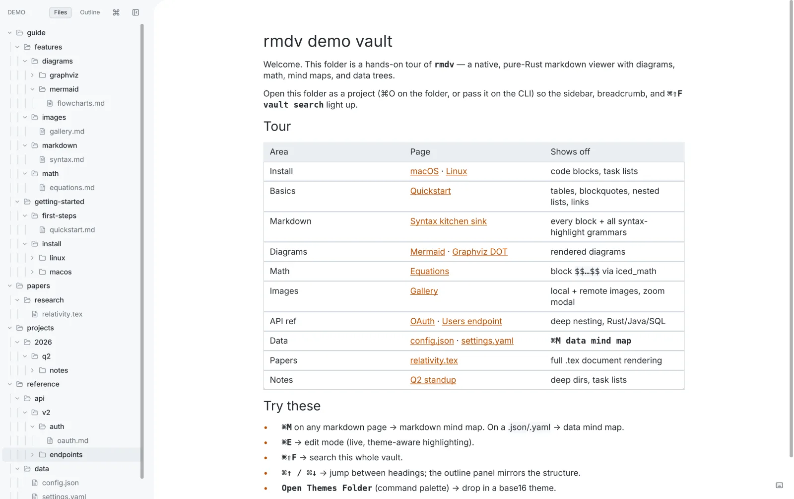
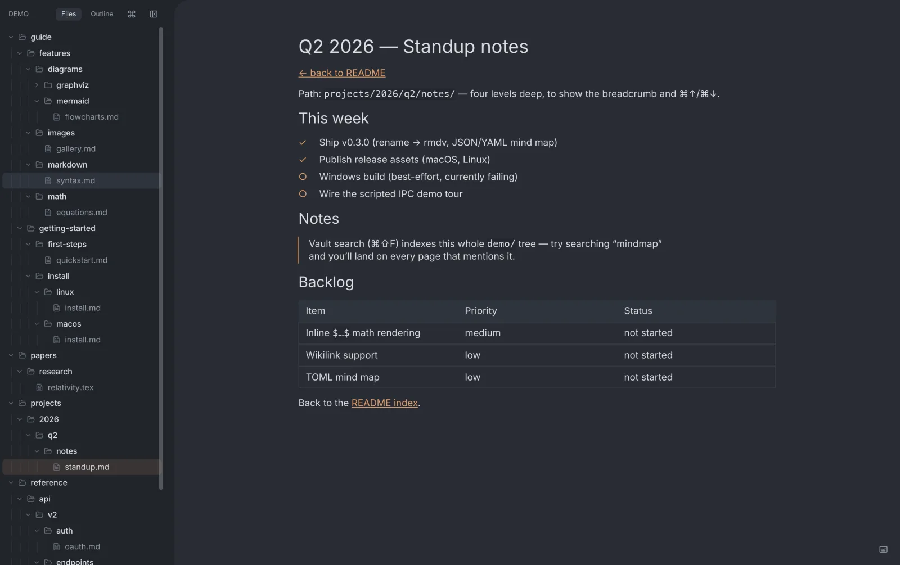

# rmdv

A native Rust markdown viewer, scriptable over an IPC socket.

[rmdv.mclee.dev](https://rmdv.mclee.dev) · [Download](https://github.com/minchenlee/rmdv/releases) · MIT

rmdv (Rust Markdown Viewer) is a fast, read-focused desktop app for browsing folders of `.md` files. It renders Markdown, [Mermaid](https://mermaid.js.org/) diagrams, Graphviz DOT graphs, block LaTeX math, and JSON/YAML mind maps without Electron, an embedded browser, or a JavaScript runtime. On macOS and Linux, it can also open text PDFs as locally extracted Markdown via PDFium.

It also exposes a scriptable IPC socket. Any program or agent (Claude Code, Codex, Cursor, a shell script) can drive the running window through the `rmdv` CLI: open files, scroll to a section, switch view mode, dump state.



## Why rmdv

rmdv is for reading a folder of Markdown files without starting a vault, an
editor-first workflow, or a static-site build. It is a pure-Rust GUI built with
[Iced](https://iced.rs/), with native Mermaid/DOT/LaTeX rendering and a
machine-readable IPC control interface.

## Features

- Workspace browser: open a folder, navigate the file tree sidebar
- Mermaid diagrams rendered natively, no JS, no browser
- Graphviz DOT diagrams rendered natively
- Block LaTeX math (`$$…$$`) via a pure-Rust layout engine ([iced_math](https://crates.io/crates/iced_math)); no MathJax, no KaTeX
- Mind-map view (`⌘M`): any Markdown, JSON, or YAML document as a collapsible tree
- Full Mindmap workspace (`⌘⇧M`): navigate folders and files as a bounded, keyboard-first graph
- Native mindmap zoom: `=` / `−` / `0`, mouse wheel, touch pinch, and macOS trackpad pinch
- PDF viewing: open a `.pdf` and read it as rendered Markdown; text extracted locally via [liteparse](https://crates.io/crates/liteparse) (PDFium), no cloud, no LLM (macOS + Linux; view-only)
- Tree-sitter syntax highlighting: Rust, Python, JS, TS, Go, C, C++, Java, SQL, Bash, JSON, HTML, Markdown, and more
- Vault-wide search (`⌘⇧F`): Zed-style full-page results across every file in the workspace
- In-document search (`⌘F`)
- Command palette (`⌘⇧P`) and quick file finder (`⌘P`)
- Live reload: edits in your editor reflect instantly
- Edit mode (`⌘E`)
- Zen editing with unsaved-edit protection across navigation
- 10 built-in theme presets: One Light/Dark, GitHub Light/Dark, Solarized Light/Dark, Gruvbox, Nord, Dracula, and Tokyo Night, with system follow
- Keyboard-first: `j`/`k`/`g`/`G`, `⌘↑`/`⌘↓`, heading fold `⌘K 0–6`
- Auto-update: checks GitHub releases, SHA-256 verifies; signed + notarized on macOS
- CJK-friendly: bundled Inter + JetBrains Mono, system font fallback
- Drag and drop files or folders

## Screenshots

| | |
|:-:|:-:|
|  |  |
| Native Mermaid / DOT / LaTeX | Full Mindmap workspace (`⌘⇧M`) |
|  |  |
| Document Mindmap (`⌘M`) | Tree-sitter highlighting |
|  |  |
| Vault-wide search (`⌘⇧F`) | 10 built-in theme presets |
|  | |
| Live reload | |

More on [rmdv.mclee.dev](https://rmdv.mclee.dev).

## Install

### macOS / Linux

Download the latest build from [Releases](https://github.com/minchenlee/rmdv/releases):

- macOS Apple Silicon: `rmdv_*_aarch64.dmg`
- macOS Intel: `rmdv_*_x86_64.dmg`
- Linux x86-64: `rmdv-*-x86_64.AppImage` (`chmod +x` then run)

After opening the macOS app for the first time, use the CLI installation toast
or run `Install CLI` from the command palette. This creates
`/usr/local/bin/rmdv`, pointing to the binary inside the app bundle.

On Linux, launch the AppImage once and use the same toast or command-palette
action. This creates `~/.local/bin/rmdv`, pointing to the AppImage. Keep
`~/.local/bin` on your `PATH` if your shell does not already include it.

### From source

    git clone https://github.com/minchenlee/rmdv && cd rmdv
    cargo build --release
    ./target/release/rmdv path/to/file.md

Requires Rust 1.80+. On Windows, build with `cargo build --release
--no-default-features`; PDF text extraction is currently available on macOS and
Linux only.

## CLI / agent control

rmdv is single-instance. The first invocation opens a window and an IPC listener; subsequent invocations talk to it and return one-line JSON.

```bash
# open a file at a specific line
rmdv path/to/foo.md --line 42

# drive the running instance
rmdv goto --section "Install/Setup"
rmdv mode mindmap
rmdv current                          # prints JSON state

# stateless — no running instance needed
rmdv list-sections path/to/foo.md     # JSON array of headings
rmdv --pretty list-sections foo.md
```

Designed for coding agents (Claude Code, Codex, Cursor) to pull rmdv to the relevant section of a file without manual navigation. `rmdv list-sections spec.md | jq` works as a pure stateless command even when rmdv isn't running.

## Keyboard shortcuts

Full Mindmap Mode (`⌘⇧M`) is an opt-in workspace navigator for seeing folders,
files, and their structure as one graph. It is separate from document Mindmap
(`⌘M`), so switching surfaces does not replace the document you are reading.

| Key | Action | | Key | Action |
|---|---|---|---|---|
| `⌘P` | File finder | | `⌘M` | Document Mindmap |
| `⌘⇧M` | Full Mindmap workspace | | `⌘⌥W` | Cycle Mindmap panel width |
| `⌘⇧P` | Command palette | | `⌘E` | Toggle edit mode |
| `⌘O` | Open folder | | `⌘T` | Toggle theme |
| `⌘B` | Toggle sidebar | | `⌘K 0–6` | Fold headings to level |
| `⌘F` | Search in document | | `⌘/` | Shortcut cheatsheet |
| `=` / `−` | Mindmap zoom in / out | | `0` | Reset mindmap zoom |
| `⌘⇧F` | Search whole vault | | `j` / `k` | Scroll down / up |
| `g` / `G` | Top / bottom | | `Space` / `⇧Space` | Page down / up |
| `Esc` | Exit Full Mindmap / close overlay | | | |

## Historical performance benchmark

The following v0.2.0 measurements were taken on an Apple M2 MacBook Pro,
median of five runs. Current builds may differ.

| Metric | Value |
|---|---|
| Cold start to first paint | ~150 ms |
| Parse a 10,000-line (~1 MB) document | 8.1 ms |

The renderer is viewport-aware: only blocks intersecting the visible viewport
become widgets. Hot reload re-highlights only changed code blocks.

See [`docs/benchmarks.md`](docs/benchmarks.md) for the full table and how to reproduce.

## Demo

The [`demo/`](demo) folder is a sample vault exercising every feature: Mermaid, DOT, LaTeX, mind maps, nested folders, vault search. Open it with `rmdv demo/`.

## Roadmap

- [x] Code signing (mac notarization)
- [x] Auto-update
- [ ] Export to PDF / HTML
- [ ] More tree-sitter grammars

## How this was built

rmdv was developed with extensive assistance from Claude (Anthropic) via
[Claude Code](https://claude.com/claude-code). The repository is open; read the
code and judge it on its merits.

<details>
<summary>About the process</summary>

My role was direction, not authorship:

- Product direction: deciding what to build and why
- Testing: running the app, finding bugs, checking features behave
- Review: reading the generated code and the diffs before they land
- Measurement: the benchmark numbers above are real, taken on my own machine and reproducible from [`docs/benchmarks.md`](docs/benchmarks.md)

I'm disclosing this because it's true and because the code should stand on its own. If something is wrong, [open an issue](https://github.com/minchenlee/rmdv/issues).

</details>

## Tech stack

Rust, with [Iced](https://iced.rs/) for the GUI (pure native widgets, no webview), [pulldown-cmark](https://github.com/raphlinus/pulldown-cmark) for Markdown parsing, and [tree-sitter](https://tree-sitter.github.io/) for syntax highlighting.

<details>
<summary>Selected dependencies</summary>

| Area | Crate |
|---|---|
| GUI | [iced](https://iced.rs/) |
| Markdown | [pulldown-cmark](https://github.com/raphlinus/pulldown-cmark) |
| Syntax highlighting | [tree-sitter](https://tree-sitter.github.io/) + per-language grammars (rust, python, js, ts, go, c, cpp, java, sql, bash, json, html, md, yaml, toml) |
| Mermaid diagrams | [mermaid-rs-renderer](https://crates.io/crates/mermaid-rs-renderer) + [layout-rs](https://crates.io/crates/layout-rs) |
| LaTeX math | [iced_math](https://crates.io/crates/iced_math) (pure-Rust layout engine) |
| SVG rasterization | [resvg](https://github.com/RazrFalcon/resvg) |
| PDF text extraction | [liteparse](https://crates.io/crates/liteparse) (PDFium) |
| Images | [image](https://github.com/image-rs/image) |
| File watching | [notify](https://github.com/notify-rs/notify) |
| HTTP (update + remote images) | [reqwest](https://github.com/seanmonstar/reqwest) |
| Async runtime | [tokio](https://tokio.rs/) |
| IPC | [interprocess](https://github.com/kotauskas/interprocess) |
| CLI | [clap](https://github.com/clap-rs/clap) |
| Serialization | [serde](https://serde.rs/) (+ json/yaml/toml) |
| Clipboard | [arboard](https://github.com/1Password/arboard) |

</details>

## Acknowledgments

- [Iced](https://iced.rs/) — the pure-Rust GUI toolkit rmdv is built on
- [tree-sitter](https://tree-sitter.github.io/) and its grammar authors — real-parser syntax highlighting
- [pulldown-cmark](https://github.com/raphlinus/pulldown-cmark), [mermaid-rs-renderer](https://crates.io/crates/mermaid-rs-renderer), [resvg](https://github.com/RazrFalcon/resvg), [liteparse](https://crates.io/crates/liteparse) — rendering and parsing
- [Inter](https://rsms.me/inter/) and [JetBrains Mono](https://www.jetbrains.com/lp/mono/) — bundled fonts
- [Claude](https://anthropic.com) via [Claude Code](https://claude.com/claude-code) — AI-assisted implementation
- [Ferrite](https://github.com/OlaProeis/Ferrite) — a fellow AI-built Rust editor whose README inspired the disclosure here

## License

MIT — see [LICENSE](LICENSE).
