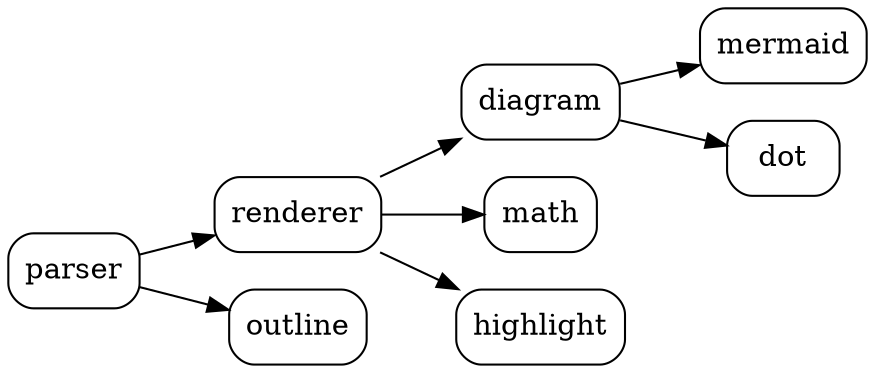
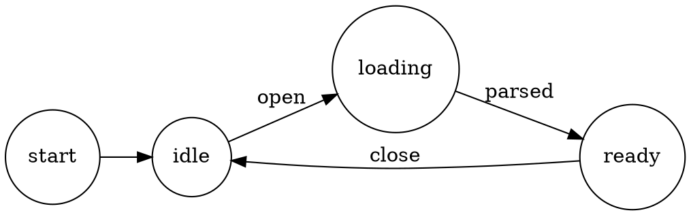

# Graphviz DOT

[← back to README](../../../../README.md)

rmdv renders ```dot (and ```graphviz) fences via a pure-Rust layout engine.

## Dependency graph



## A simple state machine



Back to [Mermaid ←](../mermaid/flowcharts.md)
