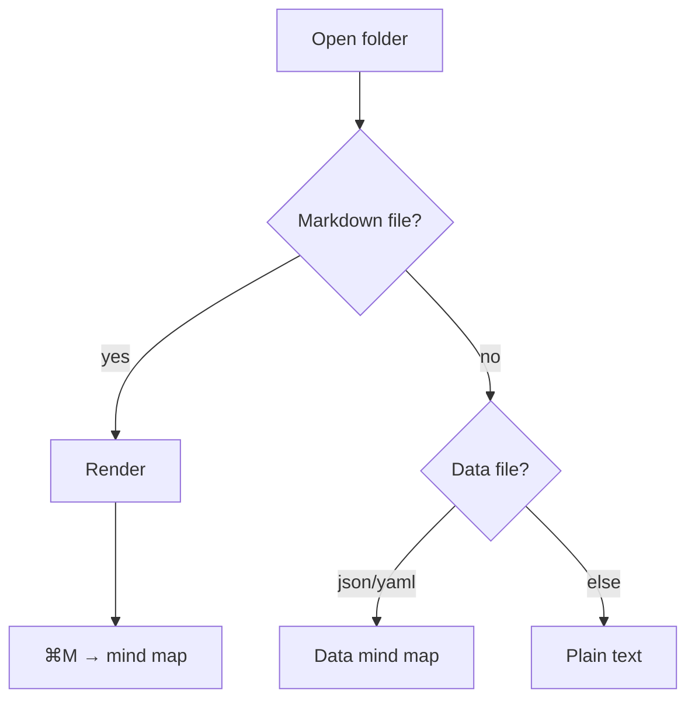
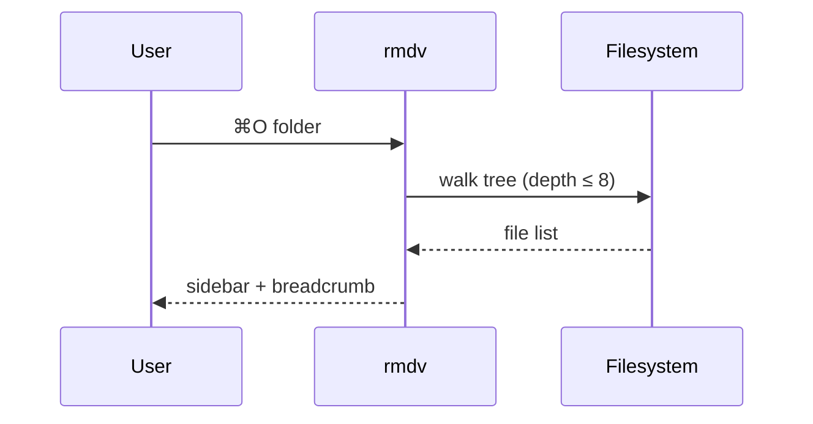
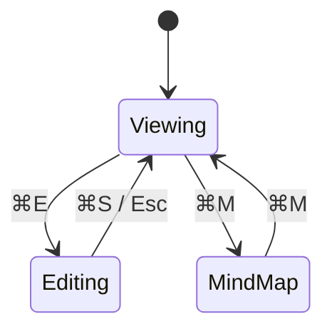

# Mermaid diagrams

[← back to README](../../../../README.md)

rmdv renders ```mermaid fences natively (no browser).

## Flowchart



## Sequence



## State



See also: [Graphviz DOT →](../graphviz/dot.md)
