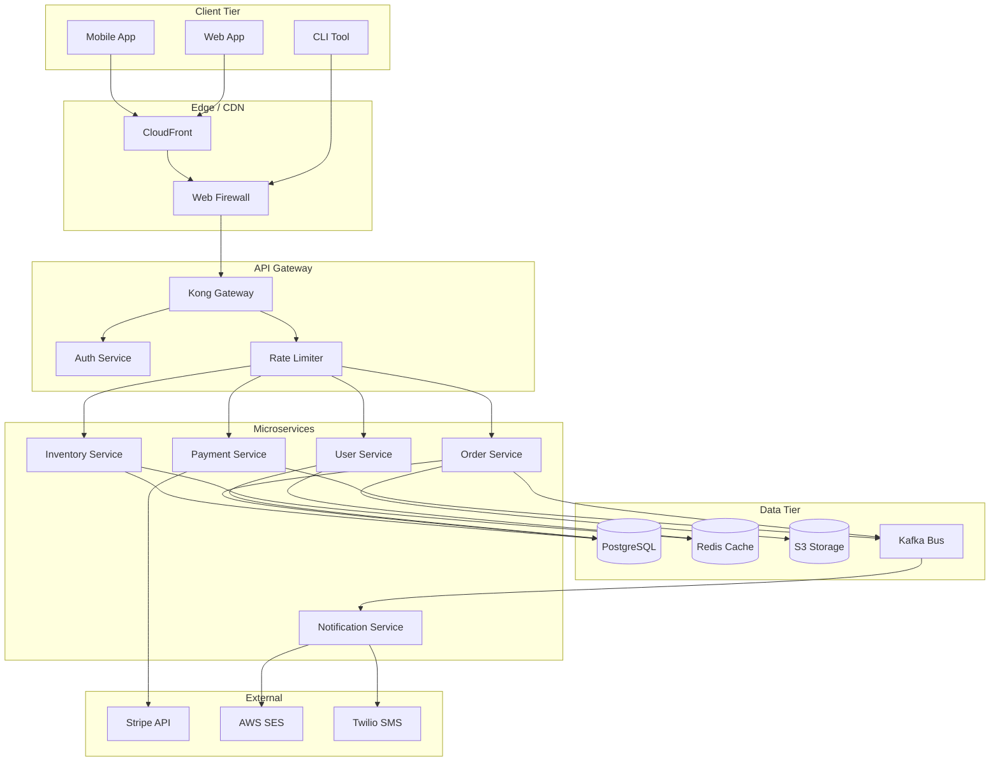
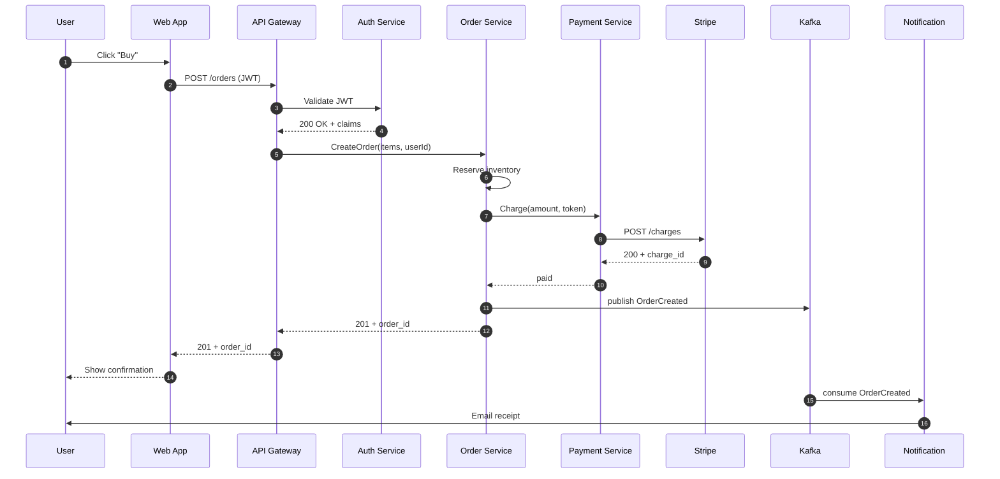
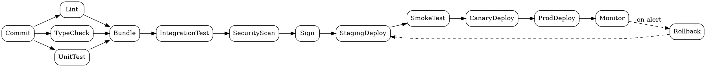
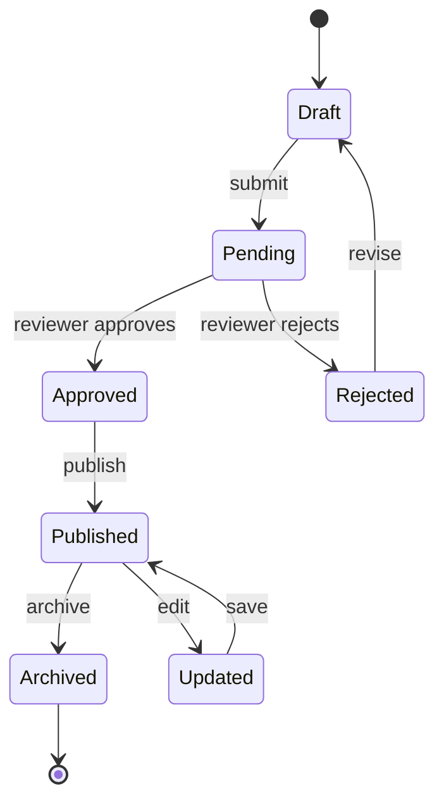
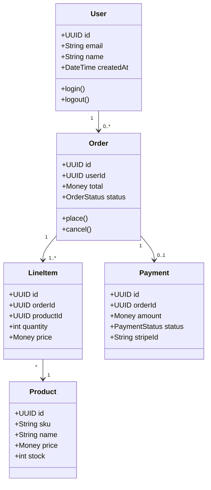
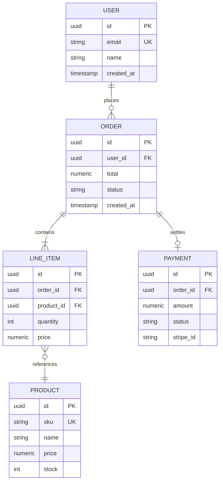
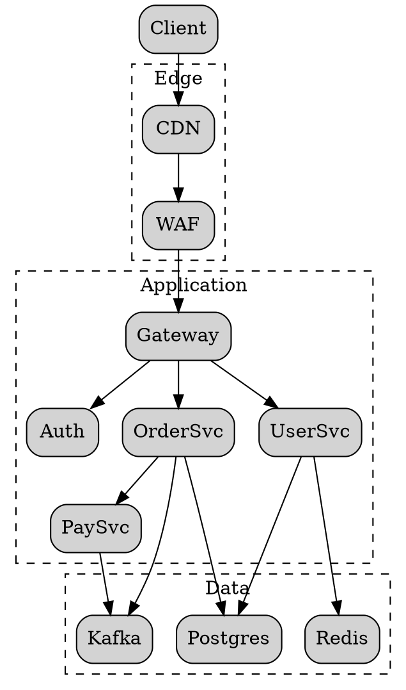

# Diagram Stress Test

Complex architecture diagrams to exercise the renderer under realistic load.

## 1. System Architecture (Mermaid flowchart)



## 2. Request Sequence (Mermaid sequence)



## 3. Build Pipeline (DOT)



## 4. State Machine (Mermaid stateDiagram)



## 5. Class / Domain Model (Mermaid classDiagram)



## 6. ER Diagram (Mermaid erDiagram)



## 7. Complex DOT (clustered)



## 8. Broken mermaid (should show error chip)

```mermaid
this is not valid mermaid syntax %%% &&& @@@
```
